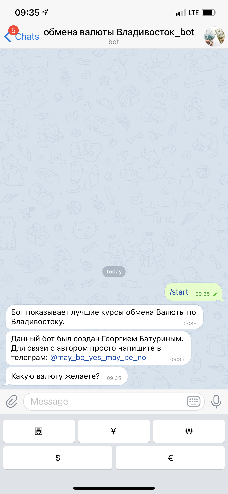
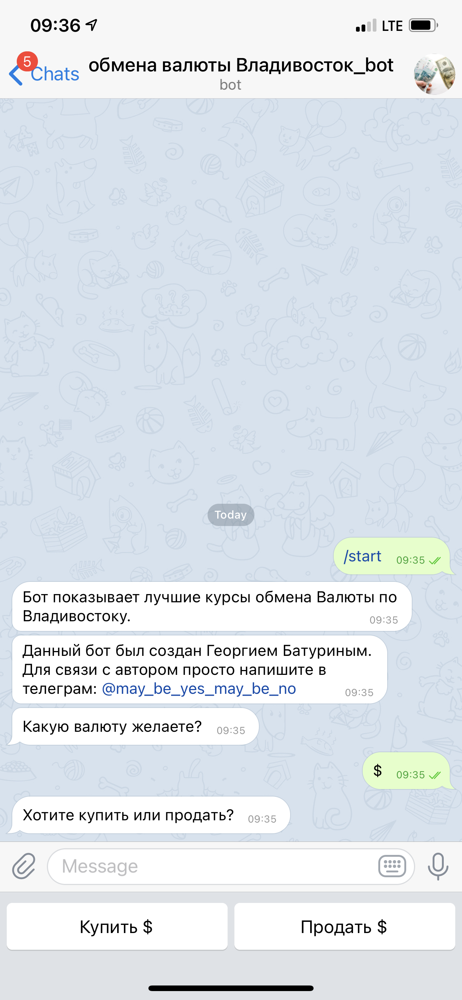
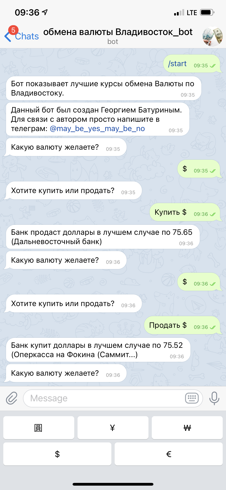

Предназначен для отображения лучшего курса покупки и продажи валюты во Владиовстоке.

Написан в 2017 и работает до сих пор.

Бот показывает лучшие курсы по 5 валютам:
- Доллар США
- Евро
- Япоская Йена
- Китайский Юань
- Корейский Вонг

Написан на Python. Для корректной работы требуется библиотека pyTelegramBotAPI.

Запуск осуществляется подобно запуску обычного консольного скрипта.

Посмотреть на пример работы можно в телеграмм, по адресу @GoshanTest_bot (доступен не всегда, бот хостится на домашнем компьютере) или поверить скриншотам

